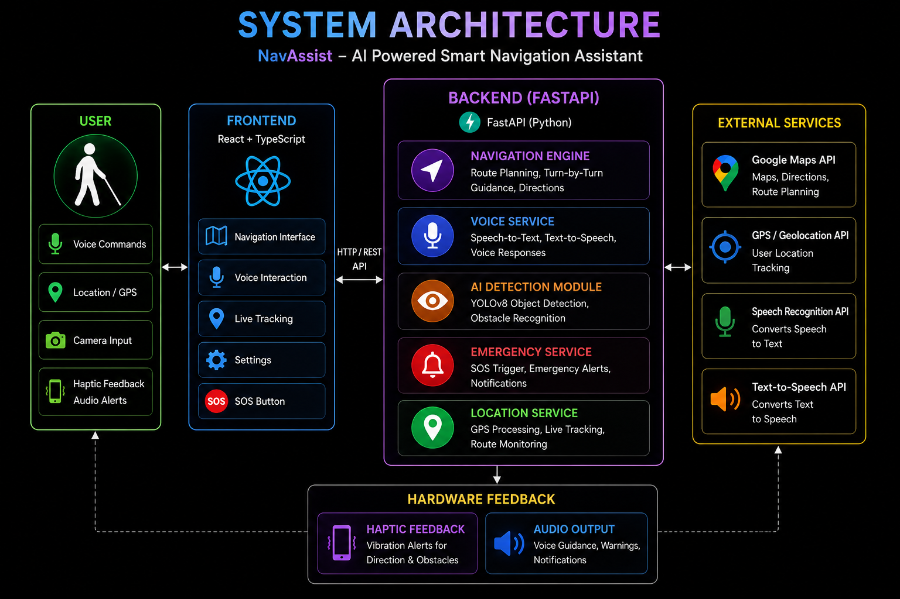
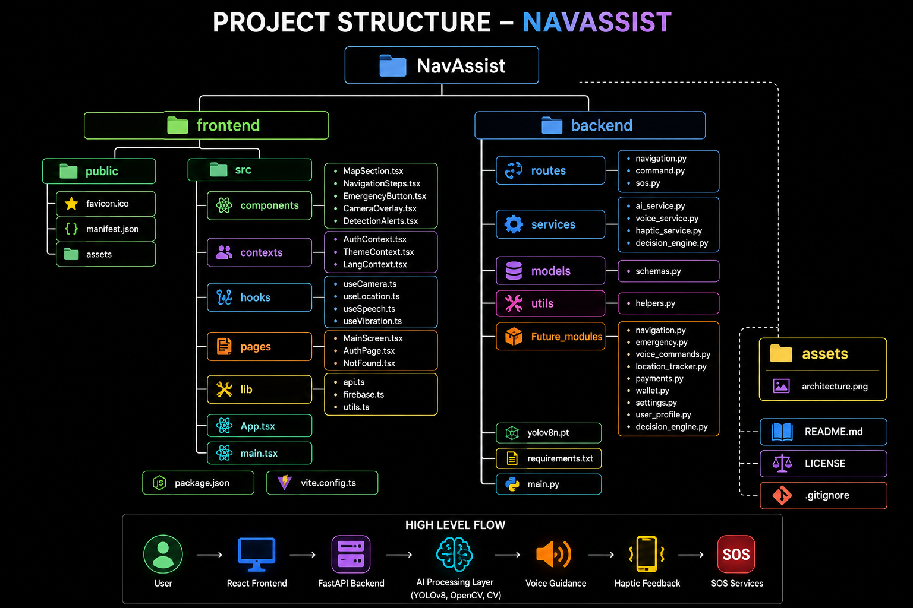

<h1 align="center">NAVASSIST</h1>
<h3 align="center"> AI-Powered Smart Navigation Assistant for Visually Impaired Users
</h3>
<h2>Overview</h2>
NavAssist is an AI-powered navigation and accessibility platform designed to help visually impaired individuals navigate safely, independently, and efficiently. The system combines Computer Vision, Real-Time Object Detection, Voice Assistance, GPS Navigation, Emergency Support, and Haptic Feedback to provide a hands-free navigation experience.
The primary objective of NavAssist is to improve mobility, safety, and accessibility for visually impaired users through intelligent assistive technology.

<h2>Features</h2>
<h3>Smart Navigation</h3>

* Real-time route guidance
* Turn-by-turn navigation assistance
* Destination search functionality
* Dynamic route updates

<h3>AI Object Detection</h3>

* YOLOv8-powered obstacle detection
* Real-time camera analysis
* Detection of pedestrians, vehicles, poles, stairs, and obstacles
* Audio alerts for detected objects

<h3>Voice Assistant</h3>

* Speech-to-Text command recognition
* Text-to-Speech navigation responses
* Hands-free interaction
* Voice-based destination input

<h3>Emergency Assistance</h3>

* SOS emergency trigger
* Emergency alert functionality
* Quick-access emergency services module

<h3>Haptic Feedback</h3>

* Vibration-based navigation alerts
* Obstacle proximity notifications
* Direction-based feedback system

<h3>Location Tracking</h3>

* Real-time GPS tracking
* Route monitoring
* Live location updates

<h3>Accessibility-Focused Design</h3>

* Voice-first interaction model
* Minimal visual dependency
* User-friendly accessible interface



<h2>Technology Stack</h2>

<h3>Frontend</h3>

* React
* TypeScript
* Vite
* Tailwind CSS

<h3>Backend</h3>

* FastAPI
* Python

<h3>AI and Computer Vision</h3>

* YOLOv8
* OpenCV
* NumPy

<h3>APIs and Services</h3>

* Google Maps API
* Browser Geolocation API
* Speech Recognition API
* Text-to-Speech API



<h2>Installation and Setup</h2>
<h3>Clone the Repository</h3>

```bash
git clone https://github.com/Tanishttha/NavAssist.git
cd NavAssist
```
<h3>Backend Setup</h3>
Navigate to the backend directory:

```bash
cd backend
```
Create a virtual environment:
```bash
python -m venv venv
```
<h3>Activate the virtual environment:</h3>
macOS / Linux

```bash
source venv/bin/activate
```
Windows

```bash
venv\Scripts\activate
```
Install dependencies:

```bash
pip install -r requirements.txt
```
Run the backend server:

```bash
uvicorn main:app --reload
```
Backend will be available at:

```bash
http://127.0.0.1:8000
```
<h3>Frontend Setup</h3>
Open a new terminal:
```bash
cd frontend

Install dependencies:
```bash
npm install

Run the development server:
```bash
npm run dev

Frontend will be available at:

http://localhost:5173

<h3>API Endpoints</h3>

Navigation

```bash
POST /navigation
```
Provides route guidance and navigation instructions.

Voice Commands

POST /command

Processes user voice commands and generates responses.

Emergency Services

POST /sos

Triggers emergency assistance functionality.

<h2>Workflow</h2>

1. User enters a destination through voice or text input.
2. Frontend sends the request to the FastAPI backend.
3. Navigation Engine generates route instructions.
4. Voice Service converts instructions into speech.
5. YOLOv8 detects nearby obstacles using camera input.
6. Haptic and audio alerts notify the user of hazards.
7. Emergency module can be activated when assistance is required.

<h2>Future Enhancements</h2>

* Offline navigation support
* Smart cane integration
* Wearable device connectivity
* Indoor navigation assistance
* Multi-language voice support
* Advanced obstacle prediction
* Edge AI deployment for low-latency inference
* Enhanced accessibility analytics

<h2>Live Demo</h2>
https://nav-assist-main.vercel.app

<h2>License</h2>
This project is licensed under the MIT License.